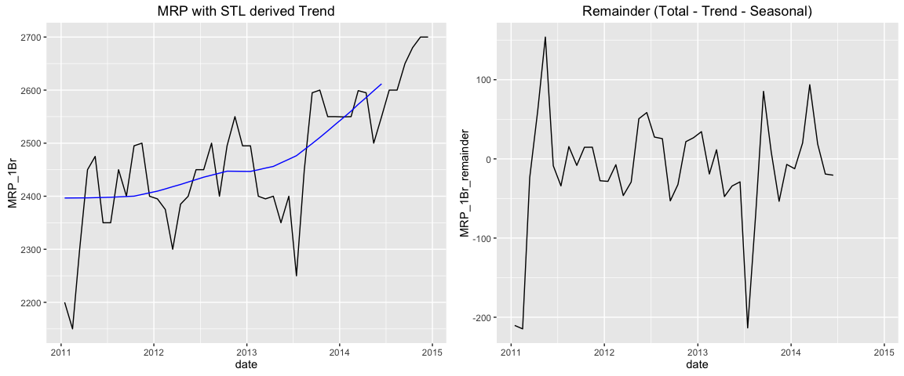
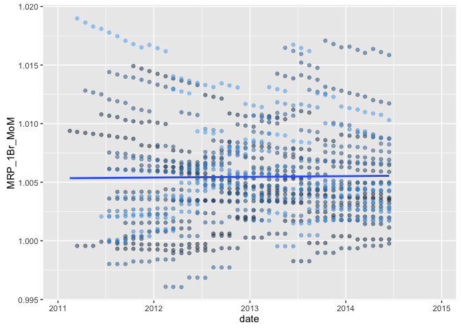
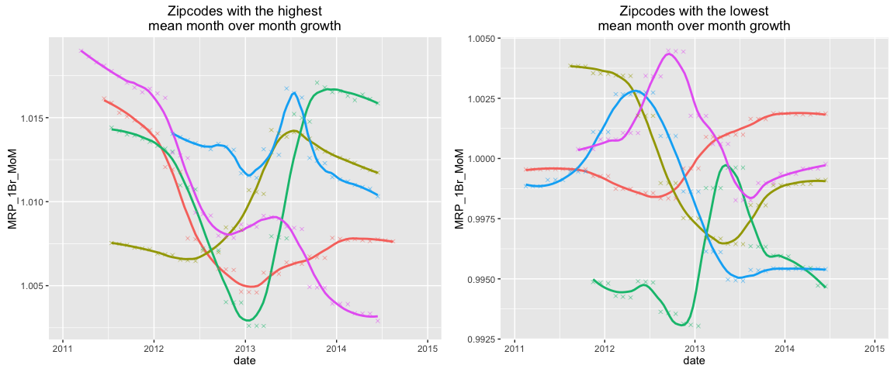
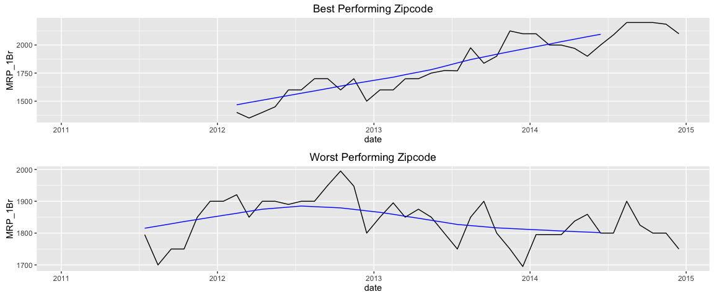
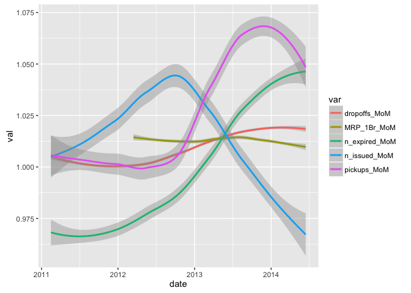
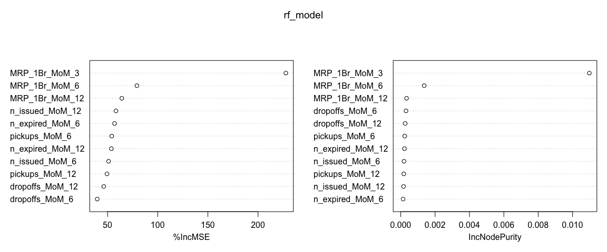
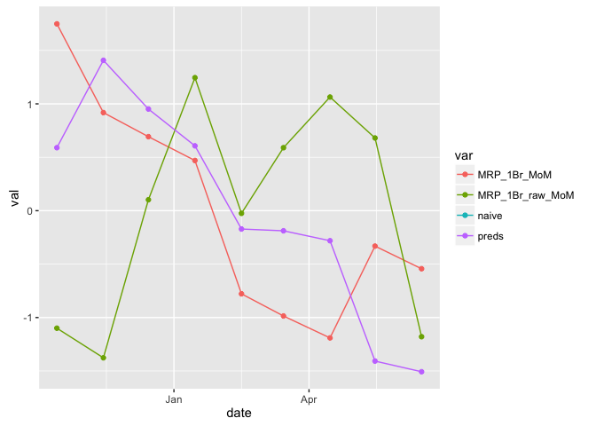
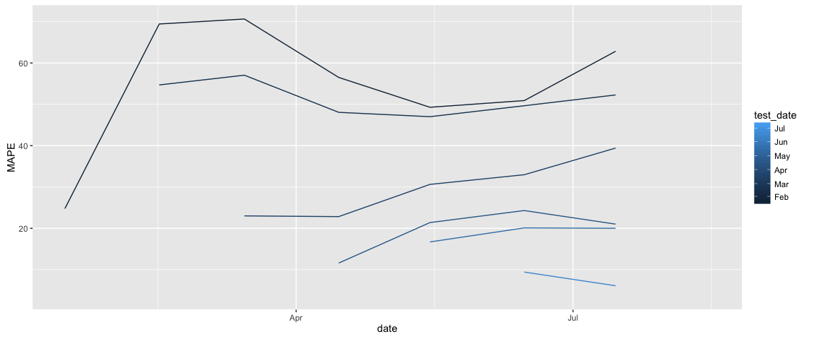
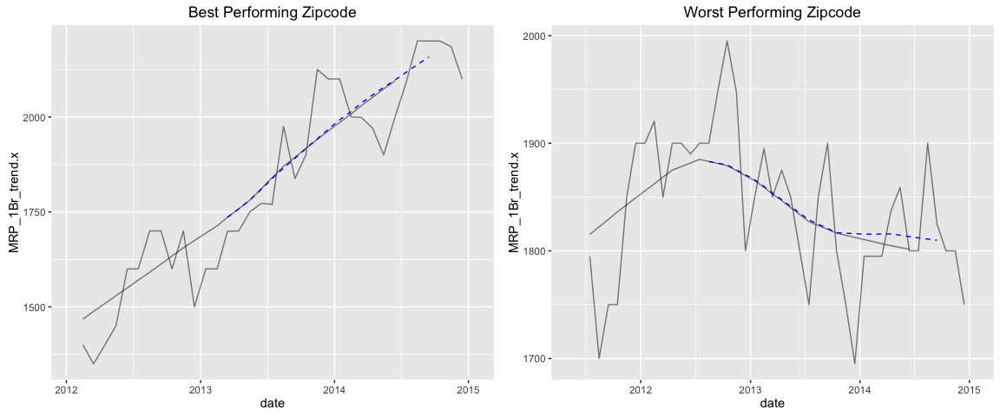

# Defining the Prediction Target
Joel Carlson  
June 24, 2016  


For each individual time series (i.e. zipcode) the time series data has been decomposed into trend, seasonal, and remainder data. By analysing the trend we can ignore the seasonal variations and random fluctuations, allowing a better picture of what is truly occurring.

The trend has been calculated on data up to June 2014, the remainder of the data will serve as a test set. Model accuracy can be judged using RMSE on the remaining 2014 data (i.e. 2014/7 - 2014/12). The score can be calculated on the mean change in those 6 months.

The goal of this project is to find those areas where the trend is significantly steeper than average. So we know the average trend, we need to find which are rising above that average.

On the trend from each zip we can calculate the month over month change, and we will expect it to be much more smooth than calculating it on the raw data.

# Goals

For each zip:
  - Fit an STL model on data up to 2014/6
  - From the STL extract the trends for the MRPs of interest, and the features (liquor and taxis)
  - Calculate the month over month changes in the trend data
  - Create a model that can predict the month over month changes in MRP *for the next month* given month over month changes in features.

That is, we wish to predict the slope/derivative/rate of change of the increase in rent.

We will acquire the median 1Br MRP for each month, do a time series decomposition, and remove the trend and seasonality from all the other data


```r
library(ggplot2); library(dplyr); library(tidyr); library(lazyeval)
library(gridExtra)
dat <- read.csv("data/all_data_with_trends.csv")
dat$date <- as.Date(dat$date)
```

Let's take a look at what the trend data looks like:


```r
z10128 <- filter(dat, zipcode == 10128) %>% select(contains("MRP_1Br"), date)

sample_trend <- ggplot(data=z10128, aes(x=date)) +
  geom_line(aes(y=MRP_1Br)) +
  geom_line(aes(y=MRP_1Br_trend), col="blue") +
  ggtitle("MRP with STL derived Trend")

sample_rem <- ggplot(data=z10128, aes(x=date, y=MRP_1Br_remainder)) +
  geom_line() +
  ggtitle("Remainder (Total - Trend - Seasonal)")

grid.arrange(sample_trend, sample_rem, ncol=2)
```

<!-- -->

The trend appears to capture the data nicely.

# Month over month trends

Below the month over month change in the trend data is calculated by dividing the current value by the previous value (so not quite the derivative, but a similar idea):


```r
dat <- dat %>% arrange(zipcode, date) %>%
  mutate(MRP_1Br_MoM = MRP_1Br_trend / lag(MRP_1Br_trend),
         MRP_1Br_raw_MoM = MRP_1Br / lag(MRP_1Br),
         n_issued_MoM = n_issued_day_trend / lag(n_issued_day_trend),
         n_expired_MoM = n_expired_day_trend / lag(n_expired_day_trend),
         pickups_MoM = pickups_day_trend / lag(pickups_day_trend),
         dropoffs_MoM = dropoffs_day_trend / lag(dropoffs_day_trend))
```

The goal of extracting the trend was to reduce volatility in the prediction target, so let's compare the volatility between the trend month over month, and the raw month over month:


```r
useless <- ggplot(data=dat, aes(x=date, y=MRP_1Br_raw_MoM, col=zipcode)) +
  geom_point(alpha=0.5) +
  coord_cartesian(ylim=c(0.9, 1.1)) +
  ggtitle("Useless") +
  guides(col=FALSE)

useful <- ggplot(data=dat, aes(x=date, y=MRP_1Br_MoM, col=zipcode)) +
  geom_point(alpha=0.5) +
  ggtitle("Useful") +
  geom_smooth(method="lm")

grid.arrange(useless, useful, ncol=2)
```

<!-- -->

This is a little difficult to look at. What about just those in brooklyn?


```r
load("data/NY_Info/brooklyn_zips.RData")
ggplot(data=filter(dat, zipcode %in% brooklyn),
       aes(x=date, y=MRP_1Br_MoM, col=zipcode)) +
  geom_point(alpha=0.5) +
  guides(col=FALSE) +
  geom_smooth(method="lm", se=FALSE, alpha=0.5)
```

<!-- -->

Fairly interesting to see.

We note that for Brokly, over the period from 2011 to mid 2014 the average month over month increase in median rental price was 1.005. A 0.5% increase. Seems that property in Brookly is not a bad investment.

We can easily explore areas with the highest and the lowest month over month increases:


```r
mean_1Br_MoMs <- dat %>%
  group_by(zipcode) %>%
  summarize(mean_MoM=mean(MRP_1Br_MoM, na.rm=TRUE)) %>%
  arrange(desc(mean_MoM))

high_perfs <- ggplot(data=filter(dat, zipcode %in% mean_1Br_MoMs$zipcode[1:5]),
       aes(x=date, y=MRP_1Br_MoM, col=as.factor(zipcode), group=as.factor(zipcode))) +
  geom_smooth(span=0.35, se=FALSE) + geom_point(alpha=0.5, shape=4) +
  ggtitle("Zipcodes with the highest\nmean month over month growth") +
  guides(col=FALSE)

low_perfs <- ggplot(data=filter(dat, zipcode %in% mean_1Br_MoMs$zipcode[98:102]),
       aes(x=date, y=MRP_1Br_MoM, col=as.factor(zipcode))) +
  geom_smooth(span=0.35, se=FALSE) + geom_point(alpha=0.5, shape=4) +
  ggtitle("Zipcodes with the lowest\nmean month over month growth") + guides(col=FALSE)
grid.arrange(high_perfs, low_perfs, ncol=2)
```

<!-- -->

For interest sake, here are the top and bottom performers for mean month over month growth:


```r
best_perf <- ggplot(data=filter(dat, zipcode==11237), aes(x=date)) +
  geom_line(aes(y=MRP_1Br)) +
  geom_line(aes(y=MRP_1Br_trend), col="blue") +
  ggtitle("Best Performing Zipcode")

worst_perf <- ggplot(data=filter(dat, zipcode==10035), aes(x=date)) +
  geom_line(aes(y=MRP_1Br)) +
  geom_line(aes(y=MRP_1Br_trend), col="blue") +
  ggtitle("Worst Performing Zipcode")

grid.arrange(best_perf, worst_perf)
```

<!-- -->

Although both had roughly similar mean rental prices around 2012, the first is trending heavily upwards now with a mean well over 2000 while the other continues to languish around 1800.

What is clear to me is that those with the highest average month over month increases are not necessarily those growing the fastest... We want those zipcodes which have an increase in their month over month every month. That is, we want the rate of change of the month over month data (i.e. analogous to the second derivative).


```r
z11237 <- filter(dat, zipcode == 11237) %>%
  select(contains("MoM"), date, -MRP_1Br_raw_MoM)

z11237 <- gather(z11237, key=date)
colnames(z11237) <- c("date", "var", "val")
ggplot(data=z11237, aes(x=date, y=val, col=var)) + geom_smooth()
```

<!-- -->

An interesting next step would be to take a look at a correlation table of lagged parameters vs param of interest - that is, how many lag periods for the number of liquor licenses applied for predicts an increase in month over month rents?

# Can we predict Month over Month changes (MoM)?

The features that we wish to use for prediction are lagged month over month changes in liquor licenses and taxi stuff, so let's create them:


```r
dat <- dat %>% arrange(zipcode, date) %>% group_by(zipcode) %>%
  mutate(MRP_2Br_MoM = MRP_2Br_trend / lag(MRP_2Br_trend), #Lag all of the pricing indicators
         MRP_3Br_MoM = MRP_3Br_trend / lag(MRP_3Br_trend),
         MRP_4Br_MoM = MRP_4Br_trend / lag(MRP_4Br_trend),
         MRP_5Br_MoM = MRP_5Br_trend / lag(MRP_5Br_trend),
         MRP_AH_MoM  = MRP_AH_trend  / lag(MRP_AH_trend),
         MRP_CC_MoM  = MRP_CC_trend  / lag(MRP_CC_trend),
         MRP_DT_MoM  = MRP_DT_trend  / lag(MRP_DT_trend))

lags <- c(1:12)         
for(n_lags in lags) {
  #Highly unfortunate syntax for programmatically creating lagged features
  dat <- dat %>% arrange(zipcode, date) %>% group_by(zipcode) %>%
    mutate_(.dots = setNames(list(interp(~ lag(n_issued_MoM, n_lags))),
                             paste0("n_issued_MoM_", n_lags))) %>%
    mutate_(.dots = setNames(list(interp(~ lag(n_expired_MoM, n_lags))),
                             paste0("n_expired_MoM_", n_lags))) %>%
    mutate_(.dots = setNames(list(interp(~ lag(pickups_MoM, n_lags))),
                             paste0("pickups_MoM_", n_lags))) %>%
    mutate_(.dots = setNames(list(interp(~ lag(dropoffs_MoM, n_lags))),
                             paste0("dropoffs_MoM_", n_lags))) %>%
    mutate_(.dots = setNames(list(interp(~ lag(MRP_1Br_MoM, n_lags))),
                             paste0("MRP_1Br_MoM_", n_lags)))

}     
```

# Model Building

To have a valid model, we need to beat the most naive model - that which predicts the mean of the data every time. The RMSE for such a model is:


```r
(sqrt(mean((dat$MRP_1Br_MoM - mean(dat$MRP_1Br_MoM, na.rm=TRUE))^2, na.rm=TRUE)))
```

```
## [1] 0.00351859
```

### Proof of concept model


```r
library(randomForest)

# Most naive method for handling NAs... Remove them
MRP_1Br_dat <- filter(dat, !is.na(MRP_1Br_MoM))

set.seed(111)

# Training and Testing sets
MRP_1Br_train <- filter(MRP_1Br_dat, date < "2013-10-15")
MRP_1Br_test <- filter(MRP_1Br_dat, date >= "2013-10-15")
```

Of course, we hope that we can achieve better accuracy using lagged predictors - lets do it!


```r
# We need more control - moving away from caret :(
rf_model <- randomForest(MRP_1Br_MoM ~  
                  #n_issued_MoM   + n_expired_MoM   + pickups_MoM   + dropoffs_MoM +
                  #n_issued_MoM_1 + n_expired_MoM_1 + pickups_MoM_1 + dropoffs_MoM_1 +
                  n_issued_MoM_6 + n_expired_MoM_6 + pickups_MoM_6 + dropoffs_MoM_6 +
                  n_issued_MoM_12 + n_expired_MoM_12 + pickups_MoM_12 + dropoffs_MoM_12 +
                  MRP_1Br_MoM_3 + MRP_1Br_MoM_6 + MRP_1Br_MoM_12,

                data=MRP_1Br_train,
                na.action = na.omit,
                mtry = 10,
                ntree=1000,
                importance=TRUE,
                nodesize=5)


#Make predictions
preds <- predict(rf_model, MRP_1Br_test)
MRP_1Br_test$preds <- NA
MRP_1Br_test[as.numeric(names(preds)), "preds"] <- preds

# Check RMSE of predictions
model_RMSE <- (sqrt(mean((MRP_1Br_test$MRP_1Br_MoM - MRP_1Br_test$preds)^2, na.rm=TRUE)))

# Check RMSE of always predicting mean of training data
naive_RMSE <- (sqrt(mean((MRP_1Br_test$MRP_1Br_MoM - mean(MRP_1Br_train$MRP_1Br_MoM, na.rm=TRUE))^2, na.rm=TRUE)))
```

The model test-set RMSE is: 0.00091

The naive test-set RMSE is: 0.00358

Test RMSE drops by ~10% if we take out the liquor and taxi data.

# Variable Importance

Obviously it would be nice if the liquor and taxi data were the most important, but they are not:


```r
varImpPlot(rf_model)
```

<!-- -->


# Investigating Predictions

Let's visualize how the model predictions compare to naive predictions:


```r
# First we add a column for the naive predictions
MRP_1Br_test <- MRP_1Br_test %>%  mutate(naive = mean(MRP_1Br_train$MRP_1Br_MoM))

set.seed(321)
sample_zip <- sample(MRP_1Br_test$zipcode, 1)
plot_dat <- filter(MRP_1Br_test, zipcode == sample_zip) %>%
  select(zipcode, date, MRP_1Br_MoM, MRP_1Br_raw_MoM,preds, naive) %>%
  mutate(MRP_1Br_raw_MoM = scale(MRP_1Br_raw_MoM),
         MRP_1Br_MoM = scale(MRP_1Br_MoM),
         naive = scale(naive),
         preds = scale(preds)) %>%
  gather(key=var, value=val, MRP_1Br_MoM:naive)

ggplot(data=plot_dat, aes(x=date, y=val, col=var)) +
  geom_point() +
  geom_line()# +
```

<!-- -->

```r
  #facet_wrap(~var, scales="free_y")
```

(naive predictions removed because they make the axes too large and wash out anything interesting)

# A cross validation procedure for time series predictions

The goal here is to define a procedure by which a model is trained using all but the last point in the time series, and the accuracy checked. Then a model is built using all but the final two points, and the accuracy checked, and so on and so forth. In this way we are able to see how the model performs as a function of how far away the data being predicted is.


```r
MRP_1Br_dat <- filter(dat, !is.na(MRP_1Br_MoM))

date_validation <- data.frame(test_date = seq(from=as.Date("2014-01-15"),
                                         to=as.Date("2014-07-15"),
                                         by="month")) %>%
  group_by(test_date) %>%
  do({
    training <- filter(MRP_1Br_dat, date < .$test_date)
    testing <- filter(MRP_1Br_dat, date >= .$test_date)

    m <- randomForest(MRP_1Br_MoM ~  
                  #n_issued_MoM   + n_expired_MoM   + pickups_MoM   + dropoffs_MoM +
                  #n_issued_MoM_1 + n_expired_MoM_1 + pickups_MoM_1 + dropoffs_MoM_1 +
                  n_issued_MoM_6 + n_expired_MoM_6 + pickups_MoM_6 + dropoffs_MoM_6 +
                  n_issued_MoM_12 + n_expired_MoM_12 + pickups_MoM_12 + dropoffs_MoM_12 +
                  MRP_1Br_MoM_3 + MRP_1Br_MoM_6 + MRP_1Br_MoM_12,

                data=training,
                na.action = na.omit,
                mtry = 10,
                ntree=500,
                importance=TRUE,
                nodesize=5)


    yhat <- predict(m, testing)

    #testing$preds <- NA
    #testing[as.numeric(names(preds)), "preds"] <- yhat

    yhat_rmse <- sqrt(mean((testing$MRP_1Br_MoM - yhat)^2, na.rm=TRUE))
    message(yhat_rmse)
    data_frame(trained_to = .$test_date, date = testing$date, pred=yhat, val=testing$MRP_1Br_MoM, rmse = yhat_rmse)

  })
```


```r
validation <- date_validation %>%
  mutate(abs_diff = abs(val - pred),
         abs_pct_err = abs(100*((1-val) - (1-pred))/(1-val))) %>%
  group_by(test_date, date) %>%
  summarize(MAE = mean(abs_diff, na.rm=TRUE),
            MAPE = mean(abs_pct_err, na.rm=TRUE),
            MAE_SD=sd(abs_diff, na.rm=TRUE))

ggplot(data=validation, aes(x=date, y=MAPE, col=test_date, group=test_date)) + geom_line()
```

<!-- -->


# Visualizing Predictions


```r
z11237 <- filter(dat, zipcode==11237)
z11237$preds <- predict(rf_model, z11237)

best_perf_preds <- ggplot(data=z11237, aes(x=date)) +
    geom_line(aes(y=MRP_1Br_MoM)) +
    geom_line(aes(y=preds), col="blue", lty=2) +
  ggtitle("Best Performing Zipcode")

z10035 <- filter(dat, zipcode==10035)
z10035$preds <- predict(rf_model, z10035)

worst_perf_preds <- ggplot(data=z10035, aes(x=date)) +
    geom_line(aes(y=MRP_1Br_MoM)) +
    geom_line(aes(y=preds), col="blue", lty=2) +
    ggtitle("Worst Performing Zipcode")

grid.arrange(best_perf_preds, worst_perf_preds, ncol=2)
```

<!-- -->

# Can we reconstruct the MRP from the MRP_MoM?

We should be able to reconstruct it using the MRP value from the first date the model begins making predictions, and propogating the calculation through the remaining values in that zip.

This gets a little technical and hacky - it is better written in the scripts folder.


```r
(test <- matrix(
         as.numeric(
         unlist(
    head(z10035[!is.na(z10035$MRP_1Br_MoM),c("MRP_1Br_trend", "MRP_1Br_MoM")]))), ncol=2, byrow=FALSE))
```

```
##          [,1]     [,2]
## [1,] 1822.269 1.003851
## [2,] 1829.259 1.003836
## [3,] 1836.249 1.003821
## [4,] 1842.752 1.003541
## [5,] 1849.254 1.003529
## [6,] 1855.757 1.003516
```

```r
start <- test[1,1]

prop_MoM <- function (value, MoM_vals)
{
    MoM_vals <- MoM_vals[-1]
    k <- length(MoM_vals)
    values <- c(value)
    if (k > 1) {
        for (i in 1:k ) {
          value <- MoM_vals[[i]]*value
          values <- c(values, value)
        }
    }
    return(values)
}

#z10035 <- filter(z10035, !is.na(MRP_1Br_trend))
#prop_MoM(z10035$MRP_1Br_trend[1], z10035$MRP_1Br_MoM)
dat$preds <- predict(rf_model, dat)
trend_predictions <- dat %>%
  group_by(zipcode) %>%
  do({
    m <- filter(., !is.na(preds)) %>%
      select(date, zipcode, MRP_1Br_trend, preds)
    try(
    m$MRP_1Br_trend_pred <- prop_MoM(m$MRP_1Br_trend[1], m$preds),
    silent=TRUE)
    m
  })

dat <- left_join(dat, trend_predictions, by=c("date","zipcode"))
```


```r
best_perf_preds <- ggplot(data=filter(dat, zipcode==11237), aes(x=date)) +
    geom_line(aes(y=MRP_1Br_trend.x), alpha=0.5) +
    geom_line(aes(y=MRP_1Br), alpha=0.5) +
    geom_line(aes(y=MRP_1Br_trend_pred), col="blue", lty=2) +
  ggtitle("Best Performing Zipcode") +
  coord_cartesian(xlim=as.Date(c("2012-01-15", "2015-01-15")))

worst_perf_preds <- ggplot(data=filter(dat, zipcode==10035), aes(x=date)) +
    geom_line(aes(y=MRP_1Br_trend.x), alpha=0.5) +
    geom_line(aes(y=MRP_1Br), alpha=0.5) +
    geom_line(aes(y=MRP_1Br_trend_pred), col="blue", lty=2) +
  ggtitle("Worst Performing Zipcode") +
  coord_cartesian(xlim=as.Date(c("2011-05-15", "2015-01-15")))

grid.arrange(best_perf_preds, worst_perf_preds, ncol=2)
```

<!-- -->


The reconstructed trends appear to do quite well!
