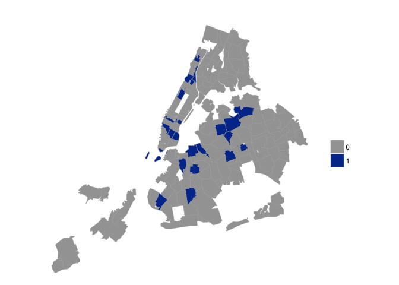

# Making the Gentrification Map
Joel Carlson  
July 2, 2016  


# Introduction

In this document I will extract the model RMSE from each model, and build a map highlighting those zipcodes for which including the liquor and taxi data improves the model accuracy.

This involves a number of steps which are abstracted away into the scripts which are imported on the first two lines. To get the RMSE for each model, the process is as follows:

**For each zipcode**:

  1. Create a training and a testing set where the test set contains N days worth of the data
    - If this is the first iteration, N = 1
  2. Perform seasonal trend decomposition:
     - On the training data
     - On the training + testing data
  4. Build a model on the training set smoothed changes only
  3. Predict the smoothed changes in rent of the test set
  4. Reconstruct the trend line of the testing data using the last point in the training data and the predicted changes
  5. Calculate the RMSE of the reconstructed trend line as a function of time from the final training point
  6. Repeat until the the training set is too small to construct a model


```r
source("scripts/extract_RMSE_SD_from_predictions.R")
source("scripts/extract_RMSE_SD_from_trend_predictions.R")

base_path <- "data/temp/"
testing_paths_1Br <- list.files(base_path, pattern="MRP_1Br_testing")

# Complete the above described loop
MRP_1Br_trend_RMSE_by_zip <- extract_testing_trend_RMSE_SD_MRP_1Br(file_paths, by_zip=TRUE)

# Clean up and reformat the data
MRP_1Br_trend_RMSE_by_zip$date <- as.Date(MRP_1Br_trend_RMSE_by_zip$date)
MRP_1Br_trend_RMSE_by_zip$months_in_future <- cut(as.numeric(MRP_1Br_trend_RMSE_by_zip$days_in_future),
                                            breaks=seq(from=1, to=365, length.out=13),
                                            labels=c(1:12))

# Create a column of the difference between full and rf model RMSE
RMSE_diff_by_zip <- MRP_1Br_trend_RMSE_by_zip %>%
  mutate(rf_diff = rf_trend_RMSE - full_rf_trend_RMSE) %>%
  group_by(zipcode) %>%
  summarize(mean_rf_diff = mean(rf_diff, na.rm=TRUE)) %>%
  arrange(desc(mean_rf_diff))
```

Below are displayed some of the zipcode for which the liquor and taxi data provide predictive power:


| zipcode| mean_rf_diff|
|-------:|------------:|
|   11237|     4.864160|
|   11238|     3.659880|
|   10004|     2.498664|
|   10025|     2.063794|
|   10011|     2.055516|
|   10039|     1.185021|
|   10009|     1.054960|
|   10031|     1.025864|


# Creating the Map

To create the map we will use the `choroplethrZip` package. This package requires the zipcodes for plotting to be in a specific format, so some processing must be done:


```r
library(reshape2); library(dplyr); library(ggplot2);
library(lazyeval); library(stringr)
library(choroplethrZip)

zips <- read.csv("~/Documents/Galvanize/CapstonePresentation/zips.csv", header=FALSE, stringsAsFactors=FALSE)
colnames(zips) <- c("zipcode", "latitude", "longitude")

#Merge zips and lat longs
dat <- full_join(RMSE_diff_by_zip, zips, by="zipcode")

# choroplethrZip errors on several specific zipcodes
dat <- filter(dat, zipcode!=11231, zipcode!=11223, zipcode!=10281, zipcode!=10048, latitude < 41.5)
dat_choro <- dat[,c("zipcode", "mean_rf_diff")]
colnames(dat_choro) <- c("region", "value")
dat_choro$region <- as.character(dat_choro$region)
dat_choro[is.na(dat_choro$value), "value"] <- min(dat_choro$value,na.rm=TRUE)

# If the full RF outperfoms the RF (i.e. the difference is positive)
# then set to 1, else 0
dat_choro$value <- ifelse(dat_choro$value > 0, 1, 0)
```

With the data in the correct format we are free to set the mapping aesthetics and create the map:


```r
pal <- c("#99B898", "#FECEA8", "#FF847C", "#E84A5F", "#2A363B")
choro = ZipChoropleth$new(dat_choro)
choro$title = ""
choro$ggplot_scale = scale_fill_manual(name="", values=c("#A3A3A3", "#033799"))
choro$set_zoom_zip(state_zoom=NULL, county_zoom=NULL, msa_zoom=NULL, zip_zoom=dat_choro$region)
choro$render()
```

<!-- -->
