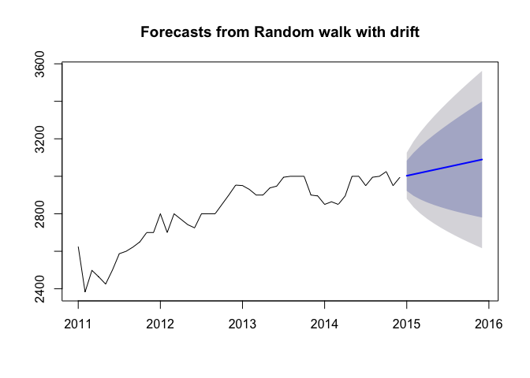

# Exploring Time Series Models
Joel Carlson  
June 23, 2016  


# Introduction

The data we have is a compilation of time series data from several different sources. Mainly, we will be attempting to forecast the change in rental prices of units in New York by their zip code, with features such as:

 - The number of liquor licenses issued in that zip
 - The number of liquor licenses expired in that zip
 - The number of taxi dropoffs
 - The number of taxi dropoffs
 - The zillow home value index?

 # Goals

The end goal is to predict which areas are most likely to be undergoing gentrification at a given time. Therefore, one method would be to build a time series model to predict year over year, or month over month changes in rental prices which are significantly different than the average month over month change for other regions.

# Data


```r
library(dplyr); library(ggplot2); library(tidyr); library(stringr)
library(forecast); library(gridExtra); library(knitr)
dat <- read.csv('data/all_data.csv', stringsAsFactors = FALSE)
dat$date <- as.Date(dat$date)

#We will restrict analysis to data from 2010 to 2016
# Sadly the data from 2015 is incomplete and unusable at this point
dat <- filter(dat, date > "2010-12-15", date < "2015-01-01")

# We will also not use the restaurant data for now
dat <- select(dat, zipcode, date, year, month, zhvi, contains("MRP"), n_issued, n_expired, pickup, dropoff)
```

# Data Cleaning

We need to clean up the data a little bit before plotting and modeling

### Missing Dates and Zips

We need to expand the data such that all dates are included, and each zip is represented


```r
dat_index <- expand.grid("year"=c(2011:2014), "month"=c(1:12), "zipcode"=unique(dat$zipcode))
dat <- full_join(dat_index, dat, by=c("zipcode", "year", "month"))

# Fix the dates - appending the final /15 allows the as.Date to accurately infer
# the correct format
dat$date <- paste0(dat$year, '/', str_pad(dat$month, 2, side='left', '0'), '/15')
dat$date <- as.Date(dat$date, format="%Y/%m/%d")
```

### Handling those dates where the Taxis didnt exist

The cause of this missing data is unclear to me - I couldnt find anything online to indicate a taxi outage or other external cause. I can only assume it is some sampling error, likely due to my own shuffling of the data.


```r
# Find those dates
weird_dates <- dat %>% group_by(year, month) %>% summarize("mean_pickups"=mean(pickup, na.rm=TRUE))
ggplot(data=weird_dates, aes(x=month, y=mean_pickups, col=as.factor(year), group=year)) +
  geom_point() +
  geom_line() +
  ggtitle("Some weird dates")
```

<!-- -->

This is not an ideal solution, but what I'm going to do is set the value of 2/2011, 4/2011, 12/2011, and 7/2012 to the mean value of the months they are between.


With this completed we see:

<!-- -->

### Narrowing Focus

The data at this moment is a little too large to be easily explored and understood. I will choose a single borough to focus on for now, and expand the model at a later time.

The borough decision will be based on the below table, which shows the percentage of data which is complete in several columns:


Table: Percentage of Non-NA Values

|borough       | MRP_1Br|  ZHVI| pickup| dropoff| issued| expired|
|:-------------|-------:|-----:|------:|-------:|------:|-------:|
|manhattan     |    84.1|  25.0|  100.0|   100.0|   69.5|    64.0|
|brooklyn      |    73.9|  70.3|   80.3|    87.0|   88.6|    84.2|
|bronx         |    43.0|  43.5|   84.6|   100.0|   82.8|    76.3|
|queens        |    29.7|  76.2|   61.8|    76.2|   61.8|    56.3|
|staten_island |     0.0| 100.0|   44.6|    53.1|   64.9|    60.9|


Based on this, I will use the Brooklyn data moving forward.


```r
dat <- filter(dat, zipcode %in% brooklyn)
```


### Handling NA values in taxi data and liquor data

I think it is safe to assume that, given the volume of taxi data, if there are missing values it means there were no taxi pickups or dropoffs in those time periods, so NAs will be filled with 0's


```r
dat[which(is.na(dat$n_issued)), "n_issued"] <- 0
dat[which(is.na(dat$n_expired)), "n_expired"] <- 0
dat[which(is.na(dat$pickup)), "pickup"] <- 0
dat[which(is.na(dat$dropoff)), "dropoff"] <- 0
```

### Collecting Zipcodes with large numbers of missing values


```r
missing_vals <- dat %>%
  group_by(zipcode) %>%
  summarize("zhvi_NAs"=100*round(sum(is.na(zhvi))/n(),3),
            "MRP_1Br_NAs"=100*round(sum(is.na(MRP_1Br))/n(),3),
            "MRP_2Br_NAs"=100*round(sum(is.na(MRP_2Br))/n(),3),
            "MRP_3Br_NAs"=100*round(sum(is.na(MRP_3Br))/n(),3),
            "MRP_AH_NAs"=100*round(sum(is.na(MRP_AH))/n(),3),
            "MRP_DT_NAs"=100*round(sum(is.na(MRP_DT))/n(),3)) %>%
  arrange(MRP_1Br_NAs)
```

We see that, for ZHVI, either they have the data or they dont - that is, they either have ZHVI scores for all years and months, or none at all.

This is not the case for the MRP, which in a sense may be better for us - this means that we can likely use some sort of moving average to interpolate the values. Let's plot a few of the zips with many missing, and some with few missing.

<!-- -->

So What is clear is that for some zipcodes data wasn't collected until a later date.


### Removing Variation due to month lengths

Since each month is a different length, it is important to divide the data for each month by the number of days in that month. In this way, we get daily activity counts per month.


```r
# add monthdays column to normalize other variables
monthdays <- data.frame("month"=c(1:12), "days_in_month"=c(31,28,31,30,31,30,31,31,30,31,30,31))
dat <- left_join(dat, monthdays, by="month")
dat <- dat %>% mutate(pickups_day = pickup/days_in_month,
                      dropoffs_day = dropoff/days_in_month,
                      n_issued_day = n_issued/days_in_month,
                      n_expired_day = n_expired/days_in_month)
```


# Modeling

Let's build some models! We will follow [this wonderful text](https://www.otexts.org/fpp/1/1) by Rob Hyndman, author of the `forecast` package.

We may compare the results of more sophisticated models we build to very naive forecasts.


```r
# get the zip with the fewest missing values
top_zip <- ts(filter(arrange(dat, year, month), zipcode==missing_vals$zipcode[1]), deltat=1/12, start=c(2011,01))
```

### Naive forecasting

The most naive model simply predicts the most recent value of a time series (i.e. ARIMA(0, 1, 0)). Let's see how it performs on the `MRP_1Br` series:


```r
naive_mod <- naive(top_zip[,"MRP_1Br"])
plot(naive_mod)
```

<!-- -->

### Seasonal Naive

This model simply predicts the value of the corresponding month from the previous year (e.g. predicts Feb 2014 val for Feb 2015)


```r
snaive_mod <- snaive(top_zip[,"MRP_1Br"], h=12)
plot(snaive_mod)
```

<!-- -->

Obviously these models are naive, but they make for good baseline comparisons.

### Drifting

The drift model is the same as drawing a line between the first and last value and forecasting the future as following that trend:


```r
drift_mod <- rwf(top_zip[,"MRP_1Br"], h=12, drift=TRUE)
plot(drift_mod)
```

<!-- -->

# Accuracy of Predictions

The forecasting accuracy of the models is assessed as follows:


```r
top_zip2 <- window(top_zip,start=2011,end=2013+0.5)

tzfit1 <- meanf(top_zip2[,'MRP_1Br'],h=6)
tzfit2 <- rwf(top_zip2[,'MRP_1Br'],h=6)
tzfit3 <- snaive(top_zip2[,'MRP_1Br'],h=6)
tzfit4 <- forecast(top_zip2[,'MRP_1Br'],h=6, robust=TRUE)
plot(tzfit3)
```

<!-- -->

```r
accuracy(tzfit1, top_zip[,'MRP_1Br'])
```

```
##                    ME     RMSE      MAE        MPE     MAPE      MASE
## Training set   0.0000 168.8418 141.1935 -0.3930006 5.241145 0.6526402
## Test set     200.3333 209.4920 200.3333  6.7714821 6.771482 0.9260025
##                   ACF1 Theil's U
## Training set 0.8752018        NA
## Test set     0.4715695  4.033874
```

```r
accuracy(tzfit2, top_zip[,'MRP_1Br'])
```

```
##                     ME     RMSE      MAE        MPE     MAPE      MASE
## Training set  12.33333 68.91214 48.56667  0.4037856 1.831590 0.2244901
## Test set     -54.16667 81.77714 59.16667 -1.8863021 2.052969 0.2734866
##                    ACF1 Theil's U
## Training set -0.3413696        NA
## Test set      0.4715695  1.863141
```

```r
accuracy(tzfit3, top_zip[,'MRP_1Br'])
```

```
##                    ME     RMSE      MAE      MPE     MAPE      MASE
## Training set 216.3421 224.4676 216.3421 7.624148 7.624148 1.0000000
## Test set      65.2500 139.0229 118.0833 2.133927 3.977184 0.5458176
##                   ACF1 Theil's U
## Training set 0.4420231        NA
## Test set     0.5808349  2.511252
```

```r
accuracy(tzfit4, top_zip[,'MRP_1Br'])
```

```
##                     ME     RMSE      MAE        MPE     MAPE      MASE
## Training set  19.14123 64.71417 50.00273  0.6519906 1.870731 0.2311280
## Test set     -38.29120 72.24741 59.16667 -1.3462379 2.042087 0.2734866
##                    ACF1 Theil's U
## Training set -0.1565480        NA
## Test set      0.4715695  1.634834
```

# Fitting a time series linear model

We can easily fit a time series lm with any of the parameters we wish to include using:


```r
tz_lm <- tslm(MRP_1Br ~   n_issued + n_expired + pickups_day + dropoffs_day, data=top_zip2)
CV(tz_lm)
```

```
##           CV          AIC         AICc          BIC        AdjR2
## 7924.8449538  278.4610729  281.9610729  287.0649962    0.7811361
```

```r
# Predict the reamining values
tz_lm_preds <- predict(tz_lm, window(top_zip, start=2013.5))
tz_lm_preds <- ts(tz_lm_preds, deltat=1/12, start=c(2013.5))

plot(top_zip[,'MRP_1Br'], col="blue")
lines(top_zip2[,'MRP_1Br'], col="black", lwd=1.5)
lines(tz_lm_preds, col="red")
```

<!-- -->


# Time Series Decomposition

We can decompose a time series into trend, seasonal, and cyclic. Here we extreact the trend:


```r
top_zip_decomp <- stl(top_zip[,'MRP_1Br'], s.window=12)
plot(top_zip[,'MRP_1Br'], col="gray",
 main="MRP trend for the top zip code",
 ylab="Median Rental Price for 1Br apts", xlab="")
lines(top_zip_decomp $time.series[,2],col="red",ylab="Trend")
```

<!-- -->

And the remaining components:


```r
plot(top_zip_decomp)
```

<!-- -->

This method of decomposition (STL) is recommended over classical decomposition (i.e. a 2x12 moving average for the trend).

### The Seasonally adjusted fit


```r
plot(top_zip[,'MRP_1Br'], col="grey",
 main="Seasonally Adjusted Fit",
  xlab="", ylab="MRP_1Br")
lines(seasadj(top_zip_decomp),col="red",ylab="Seasonally adjusted")
```

<!-- -->

Seasonally adjusted series contain the remainder component as well as the trend-cycle. Therefore they are not “smooth” and “downturns” or “upturns” can be misleading. If the purpose is to look for turning points in the series, and interpret any changes in the series, then it is better to use the trend-cycle component rather than the seasonally adjusted data.

### Forecasting with Decomposition

To forecast a decomposed time series, we separately forecast the seasonal component, and the seasonally adjusted component.
It is usually assumed that the seasonal component is unchanging, or changing extremely slowly, and so it is forecast by simply taking the last year of the estimated component. In other words, **a seasonal naïve method is used for the seasonal component**.


```r
fcast <- forecast(top_zip_decomp, method="naive")
plot(fcast, ylab="MRP 1Br")
```

<!-- -->

# Exponential Smoothing

It is beneficial to give variable weights to observations based on their temporal distance to the points being forecast. This is intutitive - we are more confident in the ability of more recent values to make predictions.


```r
tz_fit_holt <- holt(top_zip[,'MRP_1Br'], alpha=0.8, beta=0.2, h=6)
plot(tz_fit_holt, ylab="MRP 1Br", xlab="Year")
```

<!-- -->

# Neural net

Another potential method is to use a neural network:


```r
feature_matrix <- matrix(top_zip[,c('zhvi', "n_issued_day", "n_expired_day", "pickups_day", "dropoffs_day")], byrow=FALSE, nrow=nrow(top_zip))
tz_nn_fit <- nnetar(top_zip[,'MRP_1Br'], repeats=100, xreg = feature_matrix)
plot(forecast(tz_nn_fit, 1, feature_matrix))
```

<!-- -->


```r
library(caret)
creditlog  <- data.frame(score=credit$score,
 log.savings=log(credit$savings+1),
 log.income=log(credit$income+1),
 log.address=log(credit$time.address+1),
 log.employed=log(credit$time.employed+1),
 fte=credit$fte, single=credit$single)
fit  <- avNNet(score ~ log.savings + log.income + log.address +
 log.employed, data=creditlog, repeats=25, size=3, decay=0.1,
 linout=TRUE)
```

# Preparing for ARIMA

To build an ARIMA model we need to make the data stationary - [that is](https://www.otexts.org/fpp/8/1):

> A stationary time series is one whose properties do not depend on the time at which the series is observed.1 So time series with trends, or with seasonality, are not stationary — the trend and seasonality will affect the value of the time series at different times. On the other hand, a white noise series is stationary — it does not matter when you observe it, it should look much the same at any period of time.

### Auto Arima


```r
tz_aa_fit <- auto.arima(top_zip[,'MRP_1Br'])
tz_aa_fit
```

```
## Series: top_zip[, "MRP_1Br"]
## ARIMA(0,1,0)(0,0,1)[12]                    
##
## Coefficients:
##         sma1
##       0.6420
## s.e.  0.2392
##
## sigma^2 estimated as 2795:  log likelihood=-255.77
## AIC=515.55   AICc=515.82   BIC=519.25
```


# On modeling

It is highly possible that the best model will not be to actually forecast the rental prices into the future, but rather to make a forecast, and use that as a feature in a predictive model for predicting large changes in the MRP


# Conclusions

In this document I explored a number of time series modeling techniques for forecasting. It will be interesting to note for the reader that the algorithm chosen in the end for modeling the time series data (vector autogression) was not actually included in this sheet.
